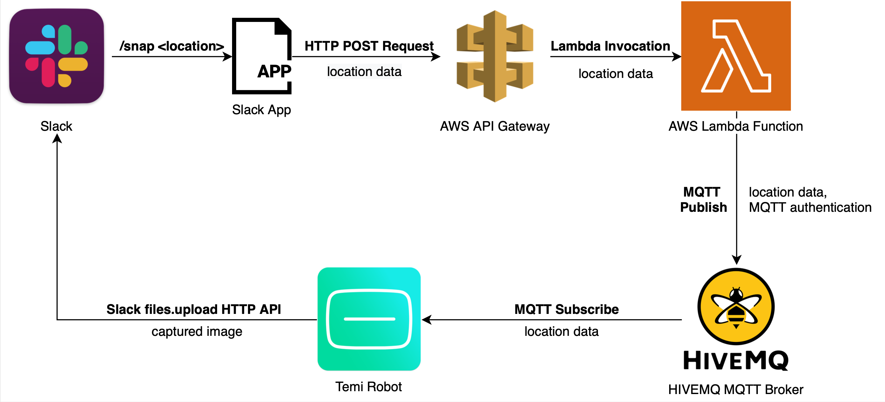
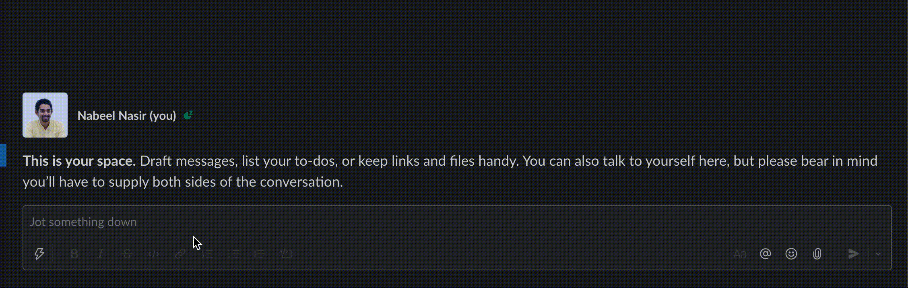
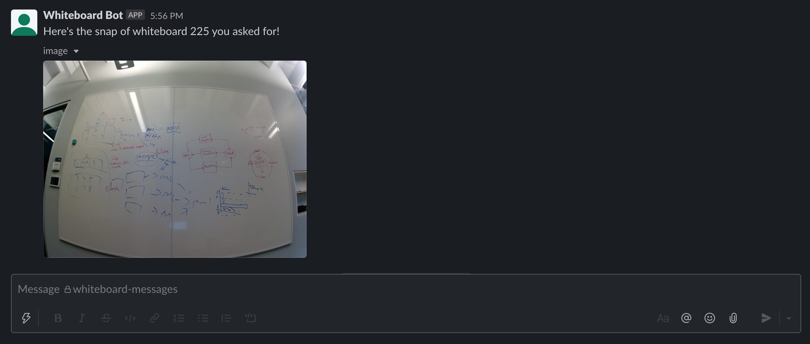

# Temi Whiteboard Snap
Send a request on Slack to the [Temi robot](https://www.robotemi.com/) to naviagate to a whiteboard location, click a picture, and send it back to Slack. This repository has an Android app which runs on the robot, and an AWS Lambda Function which receives the Slack request and forwards it to the robot.

## Workflow


- Uses [slash commands](https://api.slack.com/interactivity/slash-commands) provided by Slack to send the request:  


- Android app on Temi sends back the captured image on a pre-defined slack channel: 


- Uses the temi sdk to perform actions on the robot like navigation etc.
- Uses the Camera2 API of Android to capture images.

## Prerequisites
1. Create a Slack App. 
    - Add permissions for Incoming Webhooks and Slash Commands.
    - Generate a Bot token. This will be used to use the files.upload HTTP API.
2. Setup Temi robot and add locations of the whiteboards.
3. Setup a public MQTT broker on [HiveMQ](https://www.hivemq.com/mqtt-cloud-broker/). 
    - Keep note of the username and password which will be used in the Android app for subscription and in the Lambda function for publishing.

## Setup
1. Add apikey.json for the AWS Lambda in `aws-lambda/mqtt-publisher/`. Here's a sample:
```json
{
  "hivemq_user": "...",
  "hivemq_password": "..."
}
```
2. Add apikey.properties for Android in `android/WhiteboardSnap`. Here's a sample:
```
HIVEMQ_USER="..."
HIVEMQ_PASSWORD="..."
SLACK_USER_TOKEN="..."
```